# UK Car Sales
Vivek Bejugama  
November 15, 2016  
# Understanding the time Series trend of quaterly Car sales in UK

```r
#Importing Library
library(fpp)
```

##(a) Ploting the time series. 
We can see a periodic pattern along with overall trend in the quaterly Car sales in UK    

```r
data(ukcars)
plot(ukcars)
```

<!-- -->

##(b) Decomposition time series to calculate the trend-cycle and seasonal indices.

```r
carsTS <- decompose(ukcars)
plot(carsTS)
```

<!-- -->

##(c) The results of clasical time series decomposition ascertains our previous observation in graphical plot.

##(d) Seasonally adjusting the data

```r
carsSesn <- seasadj(carsTS)
plot(carsSesn)
```

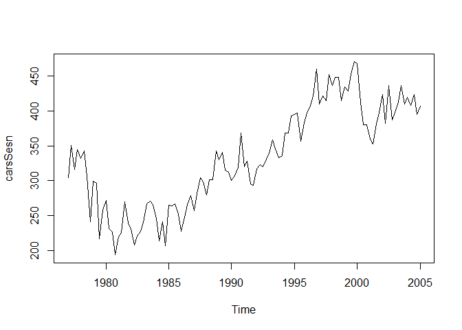<!-- -->


##(e) Effects of Outliers : Changing one observation to be an outlier

Adding an outlier in between

```r
ukcars2 <- ts(c(ukcars[1:54],ukcars[55]+500,ukcars[56:113]),start=c(1977,1),frequency=4)
plot(ukcars2)
```

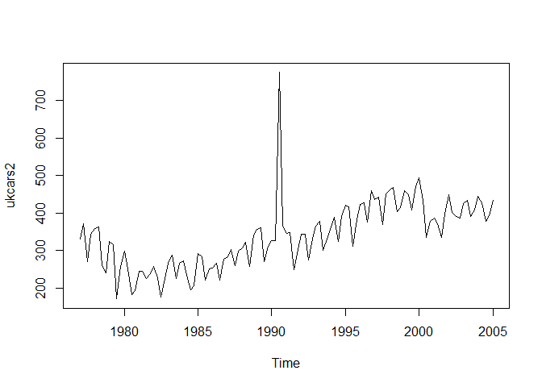<!-- -->

```r
carsTS2 <- decompose(ukcars2)
plot(carsTS2)
```

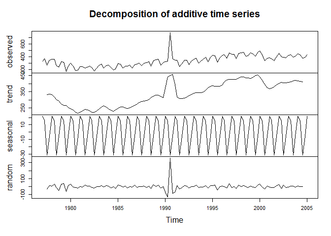<!-- -->

```r
carsSesn2 <- seasadj(carsTS2)
plot(carsSesn2)
```

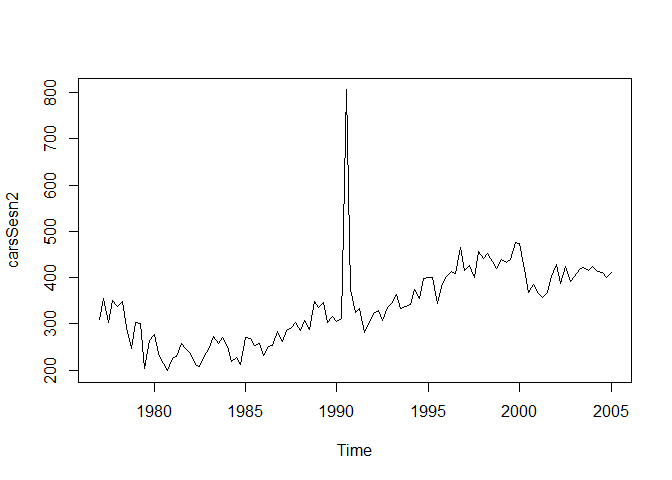<!-- -->

Adding outlier outside

```r
ukcars3 <- ts(c(ukcars[1:112],ukcars[113]+200),start=c(1977,1),frequency=4)
plot(ukcars3)
```

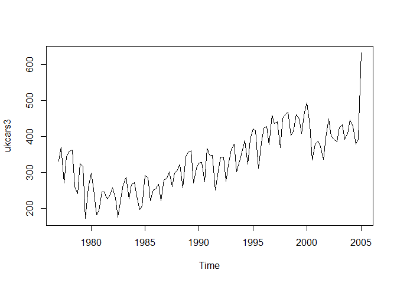<!-- -->

```r
carsTS3 <- decompose(ukcars3)
plot(carsTS3)
```

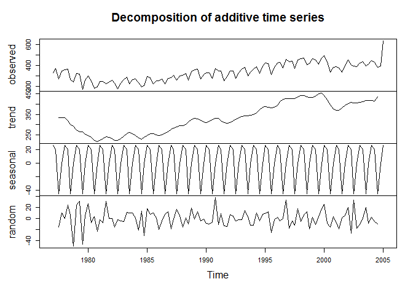<!-- -->

```r
carsSesn3 <- seasadj(carsTS3)
plot(carsSesn3)
```

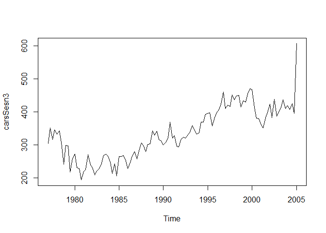<!-- -->

##(e) & (f) Impact of outliers
Having an outlier in the data impacts the trend of the data but the seasonal pattern is not much impacted.

outlier either inside or outside impacts the trend of the data similarly.


##(g) Using STL to decompose the series

```r
#Real Data
carSTL <- stl(ukcars, s.window=5)
plot(carSTL)
```

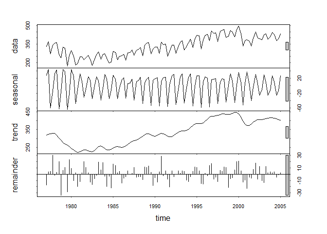<!-- -->

```r
plot(ukcars, col="gray",
  main="Car Sales in UK",
  ylab="Sales per Quater", xlab="")
lines(carSTL$time.series[,2],col="red",ylab="Trend")
```

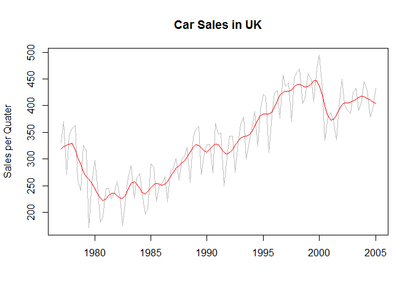<!-- -->

```r
#Outlier added in middle
carSTL2 <- stl(ukcars2, s.window=5)
plot(carSTL2)
```

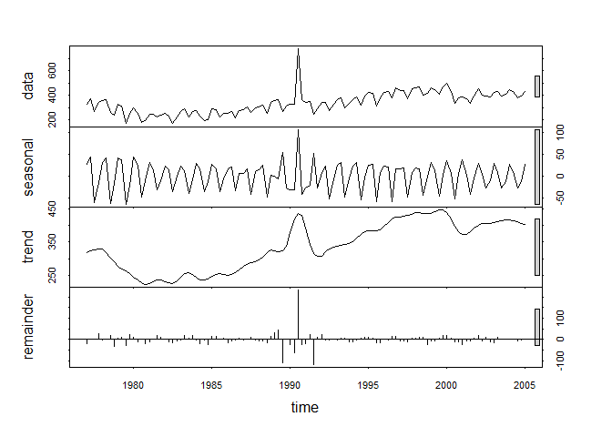<!-- -->

```r
plot(ukcars2, col="gray",
  main="Car Sales in UK adding outlier in middle",
  ylab="Sales per Quater", xlab="")
lines(carSTL2$time.series[,2],col="red",ylab="Trend")
```

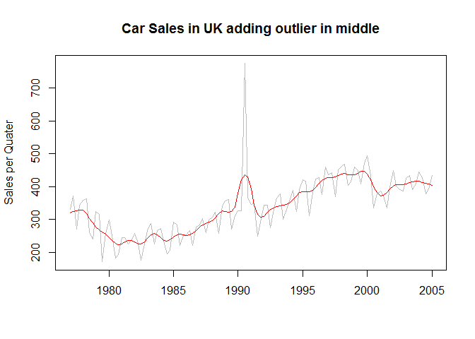<!-- -->

```r
#Outlier added in at the end
carSTL3 <- stl(ukcars3, s.window=5)
plot(carSTL3)
```

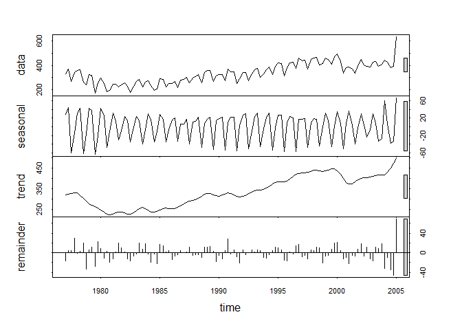<!-- -->

```r
plot(ukcars3, col="gray",
  main="Car Sales in UK adding outlier at the End",
  ylab="Sales per Quater", xlab="")
lines(carSTL3$time.series[,2],col="red",ylab="Trend")
```

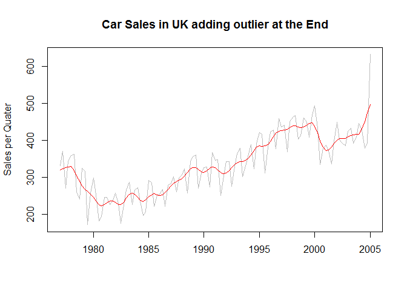<!-- -->
